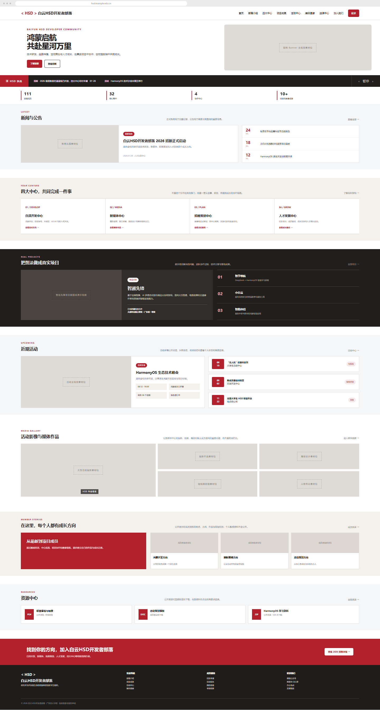
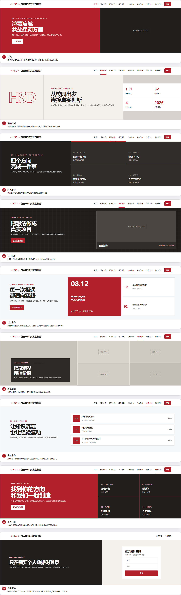

# 白云 HSD 开发者部落 Web

白云 HSD 开发者部落是广东白云学院面向技术实践、内容传播、活动策划与成员成长的校园开发者社群。本仓库用于沉淀官网需求、桌面端 Web 原型、设计规范，并作为后续前后端开发的协作基线。

> 当前版本：`v0.1 Design Preview`  
> 当前阶段：需求梳理与桌面端 Web 视觉设计  
> 当前交付不包含可运行的前端、后端或真实业务接口。

## 设计预览

### 桌面端首页

设计基准宽度为 `1440px`。本项目以电脑端 Web 为当前主要评审和开发目标，不以移动端页面作为第一版实现基准。



### 一级页面 Banner

每个一级页面使用统一的顶部导航和品牌系统。Banner 导出尺寸为 `1440 × 420px`，其中导航高 `64px`，内容区高 `356px`。



独立设计稿包括：

1. 首页
2. 部落介绍
3. 四大中心
4. 项目成果
5. 活动中心
6. 媒体画廊
7. 资源中心
8. 加入我们
9. 登录页头

独立 PNG 文件位于 [`设计稿/页面Banner`](设计稿/页面Banner)。

## 产品定位

官网不是单一技术部门的展示页，而是覆盖四个中心的综合校园社群平台：

| 中心 | 主要方向 |
| --- | --- |
| 白泽开发中心 | 鸿蒙开发、后端架构、大模型 AIGC、UI/UX、嵌入式开发 |
| 新媒体中心 | 推文、海报、摄影、剪辑与媒体运营 |
| 拓维策划中心 | 技术活动、赛事策划、外联合作与资源对接 |
| 人才发展中心 | 招新培训、梯队建设、成员成长与组织协作 |

产品主线是“了解部落、浏览内容、参与活动、加入协作、记录成长”。项目、活动、摄影作品、新闻和公开资源默认允许所有访客浏览。

只有与个人相关的内容和操作需要登录，例如：

- 查看或修改个人资料
- 查看招新申请进度
- 查看考核结果
- 查看个人活动、比赛和成长记录
- 执行需要身份确认的报名或成员操作

## 当前页面框架

桌面端一级导航为：

```text
首页 / 部落介绍 / 四大中心 / 项目成果 / 活动中心
媒体画廊 / 资源中心 / 加入我们 / 登录
```

首页当前规划包含：

```text
顶部导航
品牌 Banner
HSD 快讯
核心数据
新闻动态与近期活动
四大中心
项目成果
活动与竞赛
媒体画廊
成长路径
资源中心
招新行动区
页脚
```

HSD 快讯用于报名开放、地点变化和截止提醒等一句话可以说清的短时效信息；新闻动态用于保留完整、可归档的正式内容。

## 视觉基线

设计关键词：

```text
校园科技社群 / 编辑部式排版 / 真实作品 / 克制理性 / 青年行动力
```

核心颜色：

| 用途 | 色值 |
| --- | --- |
| 品牌深红 | `#B1202B` |
| 近黑 | `#211F1E` |
| 暖白 | `#F4F0EB` |
| 冷灰 | `#F5F6F7` |
| 图片占位灰 | `#DEDAD5` |

主要原则：

- 使用强标题、清晰栅格和整块横向内容区建立信息层级。
- 首页、项目、活动、媒体和资源页面共享品牌语言，但根据页面任务改变内容结构。
- 正式图片使用团队实拍、项目截图或经授权素材。
- 用户提供的宣传海报只作为信息参考，不直接充当网站 Banner 或背景。
- 未确认授权前，不使用华为 Logo、Huawei ICT Academy 标识或官方视觉资产。

完整设计与实现约定见 [`init/AGENTS.md`](init/AGENTS.md)。

## 仓库结构

```text
.
├─ README.md
├─ HSD需求文档.md
├─ init/
│  └─ AGENTS.md
├─ 白云HSD开发者部落-首页设计稿.png
└─ 设计稿/
   └─ 页面Banner/
      ├─ 00-Banner设计总览.png
      ├─ 01-首页Banner.png
      ├─ 02-部落介绍Banner.png
      ├─ 03-四大中心Banner.png
      ├─ 04-项目成果Banner.png
      ├─ 05-活动中心Banner.png
      ├─ 06-媒体画廊Banner.png
      ├─ 07-资源中心Banner.png
      ├─ 08-加入我们Banner.png
      └─ 09-登录页头.png
```

## 开发接手说明

开始实现前，请依次阅读：

1. [`HSD需求文档.md`](HSD需求文档.md)：了解功能范围、数据模型和非功能需求。
2. [`init/AGENTS.md`](init/AGENTS.md)：了解品牌、桌面端栅格、权限边界、响应式规则和变更记录要求。
3. [`设计稿/页面Banner/00-Banner设计总览.png`](设计稿/页面Banner/00-Banner设计总览.png)：确认各一级页面的首屏方向。
4. [`白云HSD开发者部落-首页设计稿.png`](白云HSD开发者部落-首页设计稿.png)：确认首页模块顺序与整体视觉基调。

实现时需要遵守：

- 第一版优先还原桌面端 Web，基准宽度 `1440px`，兼容 `1366px` 及以上常见电脑屏幕。
- 响应式能力可以在桌面端实现时预留，但不得用移动端页面代替桌面端交付。
- 原型中出现但尚未接入的数据应保留真实页面结构和状态，不使用空白页代替。
- 页面或模块发生变化时，同步更新需求文档、原型图和 `init/AGENTS.md` 中的设计变更记录。
- 不提交成员名单、负责人资料、教师个人信息或其他未经脱敏的社团内部文件。

## 建议技术方向

需求文档当前建议：

- 前端：Vue 3、TypeScript、Vite
- 样式：Tailwind CSS 或 SCSS
- 后台组件：Element Plus
- 后端：NestJS
- 数据库：MySQL 或 PostgreSQL

这些技术选型尚未锁定。进入开发前应结合团队熟悉度、部署环境和后续维护成本再确认。

## 第一版后续工作

- 完成各一级页面的完整桌面端页面设计，而不只停留在 Banner。
- 补充登录触发、报名、资源权限和个人信息等关键交互状态。
- 将现有需求文档整理为可验收的正式 PRD，并持续记录设计修改。
- 确认技术栈后初始化前端工程、路由和基础设计令牌。
- 接入真实项目、活动、摄影与媒体素材。

## 品牌与资料使用

“白云 HSD 开发者部落”为当前网站主名称。华为开发者生态是社群背景信息，不等同于本网站已获得华为品牌视觉资产的使用授权。

仓库中的需求与设计稿仅供本项目规划和开发协作使用。涉及学校、教师、学生、合作单位和赛事的信息在公开发布前必须确认真实性、隐私范围与授权状态。
